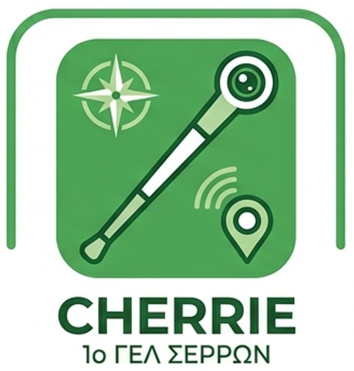

# Εισαγωγή

Διάταξη η οποία θα τοποθετηθεί σε λευκό μπαστούνι, θα λαμβάνει δεδομένα GPS ενημερώνοντας τον χρήστη με προβλήματα όρασης, για τη θέση του δίνοντάς του φωνητικές οδηγίες για καλύτερη, ευκολότερη και αποδοτικότερη μετακίνηση στην πόλη. 

Πρόκειται για τη συμμετοχή της ομάδας μας στον διαγωνισμό της ΕΛΛΑΚ 2026.

# Αλληλεπίδραση

Η διάταξη ενημερώνεται συνεχώς, μέσω GPS, για τη θέση του ατόμου και δίνει φωνητικές πληροφορίες για την κατάσταση της κίνησης, και προτείνει τη βέλτιστη διαδρομή.
Επίσης, ενημερώνει για την ύπαρξη φαναριών, σηματοδοτών και διαβάσεων.

# Χρήσεις

Επιπρόσθετη βοήθεια στα άτομα με προβλήματα όρασης κατά τη μετρακίνησή τους στην πόλη.

# Τεχνολογική υλοποίηση

- Γλώσσα Προγραμματισμού: Python

# Υλικά

- Raspberry Pi 4/5 ως “εγκέφαλος” της διάταξης.
- Κάμερα HuskyLens με ενσωματωμένη τεχνητή νοημοσύνη για ανάλυση εικόνας και αναγνώριση αντικειμένων.
- Κατάλληλη φωνητική διάταξη.
- 3D printed εξαρτήματα για το σώμα της διάταξης.

# Πορεία Υλοποίησης
Η ανάπτυξη της έξυπνης διάταξης Cherrie οργανώθηκε και υλοποιήθηκε σε τέσσερις βασικές φάσεις:  

1. Σχεδιασμός και Μηχανολογική Προσαρμογή (Hardware):

    - Πραγματοποιήθηκε ο τρισδιάστατος σχεδιασμός (3D Modeling) ειδικών, εργονομικών θηκών και εξαρτημάτων στήριξης, προκειμένου η διάταξη να μπορεί να εφαρμόσει σταθερά πάνω σε ένα τυπικό λευκό μπαστούνι.
    - Τα εξαρτήματα εκτυπώθηκαν σε 3D printer. Στη συνέχεια, έγινε η ενσωμάτωση του Raspberry Pi ως κεντρικού επεξεργαστή, της AI κάμερας HuskyLens, του δέκτη GPS και της ακουστικής/φωνητικής διάταξης (ηχείο/ακουστικά).  

2. Ανάπτυξη Λογισμικού Πλοήγησης και Γεωεντοπισμού (Software):

    - Αναπτύχθηκε ο κεντρικός κώδικας σε Python για τη λήψη και επεξεργασία των γεωγραφικών δεδομένων από το GPS σε πραγματικό χρόνο.
    - Ενσωματώθηκε βιβλιοθήκη ή API χαρτών για τον υπολογισμό της βέλτιστης διαδρομής, καθώς και λογισμικό μετατροπής κειμένου σε ομιλία (Text-to-Speech), ώστε το σύστημα να παράγει καθαρές φωνητικές οδηγίες πλοήγησης προς τον χρήστη.  

3. Εκπαίδευση AI Κάμερας και Αναγνώριση Περιβάλλοντος (Computer Vision):

    - Αξιοποιήθηκαν οι δυνατότητες μηχανικής μάθησης της HuskyLens. Η κάμερα εκπαιδεύτηκε στην αναγνώριση κρίσιμων στοιχείων του αστικού περιβάλλοντος, όπως φανάρια, οδικοί σηματοδότες, διαβάσεις πεζών και πιθανά εμπόδια στον δρόμο.
    - Σχεδιάστηκε η ροή προτεραιότητας των μηνυμάτων, ώστε οι έκτακτες οπτικές προειδοποιήσεις της κάμερας (π.χ. ύπαρξη εμποδίου) να υπερτερούν χρονικά των τυπικών οδηγιών πλοήγησης του GPS.  

4. Δοκιμές σε Πραγματικές Συνθήκες (Testing):

    - Πραγματοποιήθηκαν δοκιμές πεδίου σε εξωτερικούς χώρους για τον έλεγχο της ακρίβειας του GPS και της σταθερότητας του σήματος ανάμεσα στα κτίρια.
    - Ελέγχθηκε η ταχύτητα ανταπόκρισης της HuskyLens στην αναγνώριση των φαναριών και των διαβάσεων υπό διαφορετικές συνθήκες φωτισμού.  

# Αποτίμηση

Η υλοποίηση του Cherrie ολοκληρώθηκε με επιτυχία, επιβεβαιώνοντας τη χρησιμότητα των ανοιχτών τεχνολογιών στην επίλυση προβλημάτων προσβασιμότητας:

- Λειτουργική Αξιολόγηση: Το σύστημα πέτυχε να συνδυάσει αρμονικά τον γεωεντοπισμό (GPS) με την υπολογιστική όραση (Edge AI μέσω HuskyLens). Η συσκευή παρέχει έγκαιρη και ακριβή φωνητική πληροφόρηση, βοηθώντας τον χρήστη να προσανατολιστεί και να αναγνωρίσει κρίσιμα σημεία, όπως οι διαβάσεις και τα φανάρια.
- Κοινωνικό Όφελος: Το project προσφέρει μια καινοτόμο, χαμηλού κόστους και εύκολα υιοθετήσιμη λύση που βελτιώνει αισθητά την ποιότητα ζωής και την ασφάλεια των ατόμων με προβλήματα όρασης κατά τις καθημερινές τους μετακινήσεις στην πόλη.
- Εκπαιδευτική Εμπειρία: Η ομάδα μας απέκτησε πολύτιμες γνώσεις γύρω από την επεξεργασία δεδομένων αισθητήρων (GPS), τη χρήση έτοιμων μοντέλων τεχνητής νοημοσύνης για object recognition και τη σχεδίαση wearables (φορετών συσκευών).
- Ανοιχτή Φιλοσοφία και Μελλοντικές Επεκτάσεις: Με βάση τις αρχές της ΕΛΛΑΚ, ο κώδικας (Python) και τα κατασκευαστικά σχέδια 3D θα διαμοιραστούν ελεύθερα. Το έργο έχει μεγάλες προοπτικές εξέλιξης, καθώς στο μέλλον μπορεί να προστεθεί αισθητήρας υπερήχων για την ανίχνευση εμποδίων σε επίπεδο εδάφους ή σύνδεση με δεδομένα του δήμου για live ενημέρωση σχετικά με έργα στους δρόμους.  
